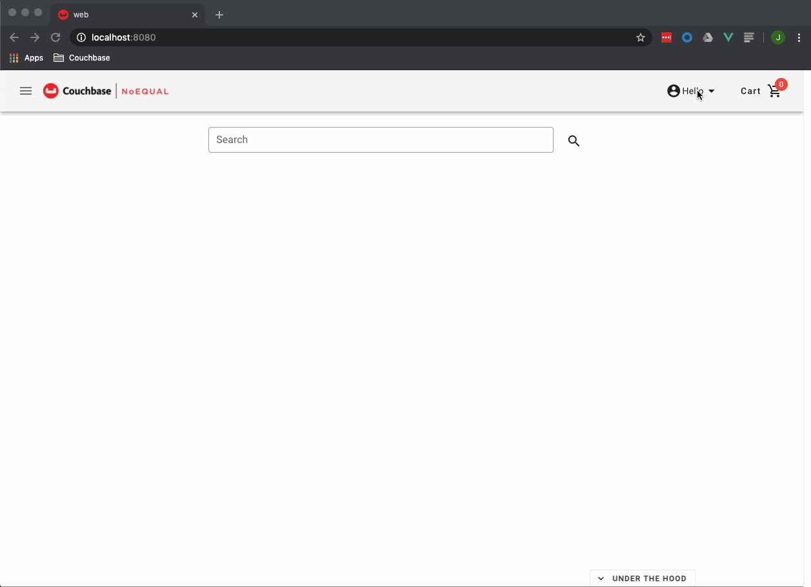
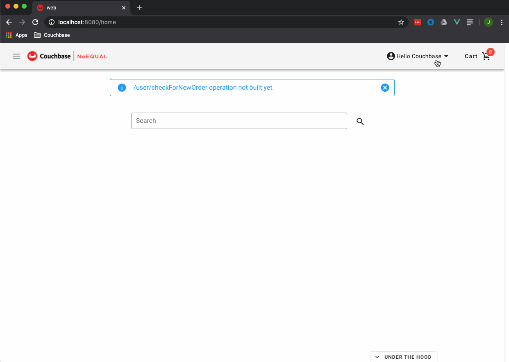

# Lab 1 - Register + K/V get

## Lab Overview

The goal of this lab is to register a new user and to retrieve a customer, utilizing Couchbase’s Node.js SDK, to perform K/V get operations.   See SDK documentation for details on using K/V operations.

>:exclamation:**IMPORTANT**:exclamation:<br> Make sure to read all IMPORTANT, REMEMBER, NOTES and DOCUMENTATION sections as important details will be provided in those sections.

## Steps

[Step 1: Register and login](#step-1-regist-and-login)<br> 
[Step 2: Add Logic to API](#step-2-add-logic-to-api)<br> 

***

### Step 1: Register and login

After both the web UI and Node.js 2.x API containers are running, a new user can be registered.  After a successful registration, the new user can login.  Follow the steps below (also:  see clip below for steps walkthrough of steps) in order to complete the registration and login.

1. Go to http://localhost:8080
2. In the top right corner, click the *Hello* next to the user icon, a drop down menu should appear.
3. In the drop down menu, click *Sign In*, the web UI should redirect to the *Login* page.
4. On the *Login* page, click the *REGISTER* button on the bottom left of the *Login* panel.
5. Enter values for all the text fields:<br> 
&nbsp;&nbsp;&nbsp;&nbsp;a.&nbsp;&nbsp;First name - any string is valid<br> 
&nbsp;&nbsp;&nbsp;&nbsp;b.&nbsp;&nbsp;Last name - any string is valid<br> 
&nbsp;&nbsp;&nbsp;&nbsp;c.&nbsp;&nbsp;Username - any string is valid<br> 
&nbsp;&nbsp;&nbsp;&nbsp;d.&nbsp;&nbsp;Email - any string with format "example@domain.com"<br> 
&nbsp;&nbsp;&nbsp;&nbsp;&nbsp;&nbsp;&nbsp;&nbsp;&nbsp;&nbsp;i.&nbsp;&nbsp;There is no validation on if the email is real<br> 
&nbsp;&nbsp;&nbsp;&nbsp;e.&nbsp;&nbsp;Password - any string is valid<br> 
6. Click the *REGISTER* button
7. After registering, the web UI should redirect to the *Login* page.  The *Login* page should display a message at the top, outlined in green, that says “Successfully registered user.  Please login.”
8. Enter the username and password used in step #5
9. Click the *LOGIN* button
10. After logging in, the web UI should redirect to the *Home* page.  “Hello {First Name}” should be displayed in the top right corner (where {First Name} is the value entered in step #5).

>**NOTE:**  The message, outlined in blue, says “/user/checkForNewOrder operation not built yet.” is indication of an endpoint that has not been implemented.  The implementation will follow in later labs.
<br> 



[Back to Steps](#steps)<br> 

### Step 2: Add Logic to API

>**Documentation:**  SDK documentation on retrieving documents can be found [here](https://docs.couchbase.com/nodejs-sdk/2.6/document-operations.html#retrieving-full-documents).

Open the repository.js file in the API repository directory (see API’s project structure detailed in the [Appendix](#nodejs-api-project-structure)).  Search for the getCustomer() method.  The goal of this lab is to edit the getCustomer() method, using Couchbase’s Node.js SDK, to perform a key-value (K/V) look-up that returns a customer document based on a given customer document key.  See documentation reference above for SDK details on retrieving documents.

>:exclamation:**IMPORTANT:**:exclamation: The K/V get operation result object contains the document along with some other metadata.  For purposes of this lab, and all other labs, only the document contents should be returned.  Therefore, upon a successful get operation, result.value is what should be returned.

*getCustomer()* input:
- customerId:  document key for an order document
- callback

*getCustomer()* output:
- error object, if applicable
- customer document:  see [Appendix](#sample-customer-document) for a sample customer document

See the following code snippet below for a possible implementation of the *getCustomer()* method.  This, or a similar solution, can be used to implement the *getCustomer()* method logic.  

>:exclamation:**REMEMBER:**  Either comment out or replace the NOP line of code ( e.g. ```callback(null, “NOP”)``` ) with the new code created in the lab.

```javascript
 getCustomer(customerId, callback) {
   try {
     /**
      * Lab 1:  K/V operation - Get
      *  1.  Get customer:  bucket.get(key)
      */
     this.bucket.get(customerId, function(err, result) {
       if (!err) {
         let customer = result.value;
         callback(err, customer);
       } else {
         callback(err, null);
       }
     });
   } catch (err) {
     //Optional - add business logic to handle error types
     outputMessage(err, "repository.js:getCustomer() - error:");
     callback(err, null);
   }
 }

```

Notes about the code:
- Line 6:  All K/V operations are done at the bucket level for 2.x SDKs (this changes for 3.x SDKs).
  + K/V get operation parameters:
    * document key
    * callback
- Line 8:  Returning only the value of the result if there is not an error.  The lab(s) only need the document’s content to be returned.
- *outputMessage()*:  a helper method used to easily print out information to the console, method can be found in the /library directory (see API’s project structure detailed in the [Appendix](#nodejs-api-project-structure))
- try/catch & err object handling is purposefully done in a generic fashion.  The lab participant is free to add logic accordingly to test out various methods of handling errors.

Once complete, make sure the *repository.js* file is saved.  Since the API Docker container maps to the API’s working directory, any updates made to the API code should be reflected in the container.  See the log command in the Appendix for further details on the state of a container.  Once the code has been saved, the user profile functionality should be active within the web UI.   Follow the steps below (also:  see clip below for walkthrough of steps) in order to see the *User Profile* page.

1. Go to http://localhost:8080
2. In the top right corner, click the *Hello {First Name}* to the user icon, a drop down menu should appear.<br> 
&nbsp;&nbsp;&nbsp;&nbsp;a.&nbsp;&nbsp;If not logged in:<br> 
&nbsp;&nbsp;&nbsp;&nbsp;&nbsp;&nbsp;&nbsp;&nbsp;&nbsp;&nbsp;i.&nbsp;&nbsp;&nbsp;&nbsp;In the drop down menu, click *Sign In*, the web UI should redirect to the *Login* page.<br> 
&nbsp;&nbsp;&nbsp;&nbsp;&nbsp;&nbsp;&nbsp;&nbsp;&nbsp;&nbsp;ii.&nbsp;&nbsp;&nbsp;Enter username and password credentials<br> 
&nbsp;&nbsp;&nbsp;&nbsp;&nbsp;&nbsp;&nbsp;&nbsp;&nbsp;&nbsp;iii.&nbsp;&nbsp;Click *Login*<br> 
&nbsp;&nbsp;&nbsp;&nbsp;&nbsp;&nbsp;&nbsp;&nbsp;&nbsp;&nbsp;iv.&nbsp;&nbsp;After logging in, the web UI should redirect to the *Home* page.  Go back to the beginning of step #2<br> 
3. In the drop down menu, click *User Profile*, the web UI should redirect to the *User Profile* page.



[Back to Steps](#steps)<br> 

### Appendix
#### Node.js API Project Structure

```
|—— configuration
|  |—— config.js
|  |—— config.json
|
|—— controllers
|  |—— productController.js
|  |—— testController.js
|  |—— userController.js
|
|—— library
|  |—— outputMessage.js
|  |—— verifyToken.js
|
|—— repository
|  |—— repository.js
|
|—— service
|  |—— productService.js
|  |—— userService.js
|
|—— Dockefile.dev
|—— package.json
|—— server.js
```

#### Sample Customer Document

```json
{
  "doc": {
    "type": "customer",
    "schema": "1.0.0",
    "created": 1559780511352,
    "createdBy": 195,
    "modified": 1587833486406,
    "modifiedBy": 702
  },
  "_id": "customer_100",
  "custId": 100,
  "custName": {
    "firstName": "Hilton",
    "lastName": "Schinner"
  },
  "username": null,
  "email": "Karianne39@gmail.com",
  "createdOn": "2019-06-08",
  "address": {
    "home": {
      "address1": "4810 Hegmann Manors Burgs",
      "city": "North Ivahfort",
      "state": "WY",
      "zipCode": "01961",
      "country": "KG"
    },
    "work": {
      "address1": "198 Molly Mountain Plains",
      "city": "South Clifton",
      "state": "CT",
      "zipCode": "77161",
      "country": "SA"
    }
  },
  "mainPhone": {
    "phone_number": "682126158733138",
    "extension": null
  },
  "additionalPhones": {
    "type": "Other",
    "phone_number": "987601914834116",
    "extension": null
  }
}

```

