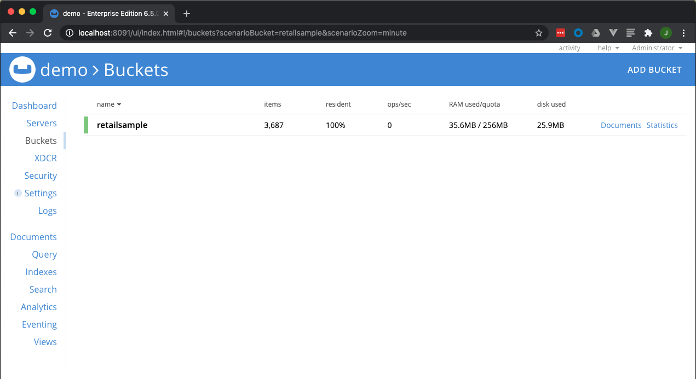

# Running Couchbase Server locally

## Overview

This steps below can be used to run a local instance of Couchbase Server.  The instance will include a subset of the retail sample dataset used in the labs.

<br>

[Back to Project Home](../README.md)<br> 

# Prerequisites

1. *Docker*

>**NOTE:** While you can run a local instance of Couchbase Server (www.couchbase.com/downloads), other steps must be taken in order to load the dataset into Couchbase.  That is beyond the scope of the labs (however, those inclined can put the pieces together by looking at how the *Docker* container is built and run).

# Paths

[Build and use local *Docker* container](#path-build-and-use-local-docker-container)<br> 
[Use published *Docker* Container](#path-use-published-docker-container)<br> 


***

## Path: Build and use local *Docker* container

### Clone the local Couchbase Server instance *git* repository

cb-dev-days-db repository includes all resources needed to run a local copy of Couchbase Server to use with the labs.  Use git CLI to clone the repository.

```console
$ git clone https://github.com/thejcfactor/cb-dev-days-db.git
```

Once the repository has been cloned, a cb-dev-days-db directory should exist in the current working directory.  Change the working directory to cb-dev-days-db.

```console
$ cd cb-dev-days-db
```

### Build the local Couchbase Server instance *Docker* container

Build the *Docker* image for the local Couchbase Server instance by using the following *Docker* command.  A brief description of the arguments provided to our *docker build* command are described below:
- **-t**:  This option sets a tag for the *Docker* image
- **-f**:  This option points to the Dockerfile that should be used to build the *Docker* image
- **./**:  Points to the context for which the build command will reference, in this example, the context is the current working (cb-dev-days-db)

```console
$ docker build -t cbdd-db -f Dockerfile.dev ./
Sending build context to Docker daemon  2.828MB
Step 1/15 : FROM couchbase:latest
 ---> fe5da7e004db
Step 2/15 : RUN apt-get update
 ---> Running in 347b5077b78e
Get:1 http://archive.ubuntu.com/ubuntu xenial InRelease [247 kB]
Get:2 http://security.ubuntu.com/ubuntu xenial-security InRelease [109 kB]
Get:3 http://security.ubuntu.com/ubuntu xenial-security/main amd64 Packages [1149 kB]
Get:4 http://archive.ubuntu.com/ubuntu xenial-updates InRelease [109 kB]
Get:5 http://archive.ubuntu.com/ubuntu xenial-backports InRelease [107 kB]
Get:6 http://archive.ubuntu.com/ubuntu xenial/main amd64 Packages [1558 kB]
Get:7 http://security.ubuntu.com/ubuntu xenial-security/restricted amd64 Packages [12.7 kB]
Get:8 http://security.ubuntu.com/ubuntu xenial-security/universe amd64 Packages [631 kB]
Get:9 http://security.ubuntu.com/ubuntu xenial-security/multiverse amd64 Packages [6679 B]
Get:10 http://archive.ubuntu.com/ubuntu xenial/restricted amd64 Packages [14.1 kB]
Get:11 http://archive.ubuntu.com/ubuntu xenial/universe amd64 Packages [9827 kB]
Get:12 http://archive.ubuntu.com/ubuntu xenial/multiverse amd64 Packages [176 kB]
Get:13 http://archive.ubuntu.com/ubuntu xenial-updates/main amd64 Packages [1515 kB]
Get:14 http://archive.ubuntu.com/ubuntu xenial-updates/restricted amd64 Packages [13.1 kB]
Get:15 http://archive.ubuntu.com/ubuntu xenial-updates/universe amd64 Packages [1034 kB]
Get:16 http://archive.ubuntu.com/ubuntu xenial-updates/multiverse amd64 Packages [19.7 kB]
Get:17 http://archive.ubuntu.com/ubuntu xenial-backports/main amd64 Packages [7942 B]
Get:18 http://archive.ubuntu.com/ubuntu xenial-backports/universe amd64 Packages [9084 B]
Fetched 16.5 MB in 7s (2193 kB/s)
Reading package lists...
Removing intermediate container 347b5077b78e
 ---> 65543db65b37
Step 3/15 : RUN apt-get -y install zip unzip
 ---> Running in 26a9a0ddfd26
Reading package lists...
Building dependency tree...
Reading state information...
The following NEW packages will be installed:
  unzip zip
0 upgraded, 2 newly installed, 0 to remove and 17 not upgraded.
Need to get 317 kB of archives.
After this operation, 1117 kB of additional disk space will be used.
Get:1 http://archive.ubuntu.com/ubuntu xenial/main amd64 unzip amd64 6.0-20ubuntu1 [158 kB]
Get:2 http://archive.ubuntu.com/ubuntu xenial/main amd64 zip amd64 3.0-11 [158 kB]
debconf: delaying package configuration, since apt-utils is not installed
Fetched 317 kB in 0s (364 kB/s)
Selecting previously unselected package unzip.
(Reading database ... 11606 files and directories currently installed.)
Preparing to unpack .../unzip_6.0-20ubuntu1_amd64.deb ...
Unpacking unzip (6.0-20ubuntu1) ...
Selecting previously unselected package zip.
Preparing to unpack .../archives/zip_3.0-11_amd64.deb ...
Unpacking zip (3.0-11) ...
Setting up unzip (6.0-20ubuntu1) ...
Setting up zip (3.0-11) ...
Removing intermediate container 26a9a0ddfd26
 ---> bb3b8bf0c341
Step 4/15 : COPY configure-node.sh /opt/couchbase
 ---> 5d754504a407
Step 5/15 : COPY ./data/retailsample_data.zip /opt/couchbase
 ---> 1e69c65b4354
Step 6/15 : COPY ./data/indexes.txt /opt/couchbase
 ---> 5561d3b7a605
Step 7/15 : COPY ./data/basic_search_idx.json /opt/couchbase
 ---> db5bdc2b2187
Step 8/15 : RUN chmod +x /opt/couchbase/configure-node.sh
 ---> Running in f0d508a7eea6
Removing intermediate container f0d508a7eea6
 ---> fd6e8e3f8eca
Step 9/15 : ENV CB_HOST 127.0.0.1
 ---> Running in c5ccb93dad6b
Removing intermediate container c5ccb93dad6b
 ---> 3f80e4c0fd39
Step 10/15 : ENV CB_PORT 8091
 ---> Running in 8300ef0da8c4
Removing intermediate container 8300ef0da8c4
 ---> b177850c39d6
Step 11/15 : ENV CB_URL ${CB_HOST}:${CB_PORT}
 ---> Running in afa238cce666
Removing intermediate container afa238cce666
 ---> 35dfddb89dd2
Step 12/15 : ENV CB_USER Administrator
 ---> Running in bb8e069aa87f
Removing intermediate container bb8e069aa87f
 ---> 977449605a65
Step 13/15 : ENV CB_PASSWORD password
 ---> Running in d88f60942638
Removing intermediate container d88f60942638
 ---> f88d239919cd
Step 14/15 : ENV CB_BUCKET retailsample
 ---> Running in bdd469d01b68
Removing intermediate container bdd469d01b68
 ---> f9e3ea305d75
Step 15/15 : CMD ["/opt/couchbase/configure-node.sh"]
 ---> Running in 676357141ca8
Removing intermediate container 676357141ca8
 ---> 890a512f9d17
Successfully built 890a512f9d17
Successfully tagged cbdd-db:latest

```

Verify the *Docker* image has been built by using the following *Docker* command. 

```console
$ docker image ls --all
REPOSITORY          TAG                 IMAGE ID            CREATED             SIZE
cbdd-db             latest              890a512f9d17        2 minutes ago       1.2GB
```


### Create the local Couchbase Server insance *Docker* container

Start a new *Docker* container for the image of local instance of Couchbase Server previously built.  A brief description of the arguments provided to our *docker run* command are described below:
- **--rm**:  This option will allow the container to be removed when container is stoped
- **--name**:  optional name for the created container, we will be naming this container "db"
- **-d**:  Runs the *Docker* container in detached mode, so that control is returned to the terminal
- **-p**: This is used for port forwarding.  In this example we are forwarding port ranges 8091-8094 and 11210-11211 in the container to port ranges 8091-8094 and 11210-11211 respectively on the host<br>

```console
$ docker run --rm --name db -d -p 8091-8094:8091-8094 -p 11210-11211:11210-11211 cbdd-db
f0fc020fc039be0e97226569521641198bc94af2869577faf7a8ae37e7040079
```

When the container is running, *Docker* will display a container id.
> **Note:** The container id will be different from the one in the documentation.

Verify that the container is running by using the following *Docker* command. 

```console
$ docker container ls --all

CONTAINER ID   IMAGE    COMMAND      CREATED         STATUS             PORTS                   NAMES  
f0fc020fc039   cbdd-db  "/entrypo…"  30 seconds ago  Up 30 seconds   8095-8096/tcp, 0.0.0.0:8091-8094->8091-8094/tcp, 11207/tcp, 0.0.0.0:11210-11211->11210-11211/tcp, 18091-18096/tcp   db

```

You can view the container logs by running the following command.  Content in the log output should show Couchbase server is running, followed by log output indicating data is being imported and indexes have been created (both N1QL and Full Text Search).

Open a browser (we recommend Chrome or Firefox...please don’t use Internet Explorer), and navigate to Couchbase Server’s web console.

Url:  http://localhost:8091
Username: Administrator
Password:  password

You should be able to see the web console’s dashboard after entering in the credentials above.  In the dashboard screen, navigate to the Buckets screen by clicking the Buckets tab on the left-side of the screen and verify the retailsample bucket has loaded 3,687 items (see screenshot below).



[Back to Paths](#paths)<br> 

### Path: Use published *Docker* Container
 
Start a new *Docker* container for the local instance of Couchbase Server.  A brief description of the arguments provided to our *docker run* command are described below:
- **--rm**:  This option will allow the container to be removed when container is stoped
- **--name**:  optional name for the created container, we will be naming this container "db"
- **-d**:  Runs the *Docker* container in detached mode, so that control is returned to the terminal
- **-p**: This is used for port forwarding.  In this example we are forwarding port ranges 8091-8094 and 11210-11211 in the container to port ranges 8091-8094 and 11210-11211 respectively on the host<br>


```console
$ docker run --rm --name db -d -p 8091-8094:8091-8094 -p 11210-11211:11210-11211 thejcfactor/cbdd-db:initial-release
        
Unable to find image 'thejcfactor/cbdd-db:initial-release' locally
initial-release: Pulling from thejcfactor/cbdd-db
8e097b52bfb8: Already exists
a613a9b4553c: Already exists
acc000f01536: Already exists
73eef93b7466: Already exists
d93189247c37: Already exists
20eb3c0bcf65: Already exists
cb2318905c13: Already exists
602b2eb1c22e: Already exists
b58e4a9a4936: Already exists
96a939f547ba: Already exists
2c9a99731241: Already exists
568c5ac154f2: Already exists
b7c3bbd4e6d7: Already exists
9e43002f8da7: Already exists
09d59493cc8b: Pull complete
c6fcd258b541: Pull complete
55d716ef2bcb: Pull complete
cf1299100514: Pull complete
aa881b2dcb4f: Pull complete
05c034d424ef: Pull complete
a329c115f080: Pull complete
Digest: sha256:d16341edeb509e27eddcbbd44f1da08a0e80ae54c48dc85f25de230cfe6e8297
Status: Downloaded newer image for thejcfactor/cbdd-db:initial-release
b81a7867f3f23835d3f9273606dd24971cbf8c700ba81197d90760eb7f4b8553

```

When the container is running, *Docker* will display a container id.
> **Note:** The container id will be different from the one in the documentation.

Verify that the container is running by using the following *Docker* command. 

```console
$ docker container ls --all

CONTAINER ID   IMAGE    COMMAND      CREATED         STATUS             PORTS                   NAMES  
b81a7867f3f2   thejc... "/entrypo…"  15 minutes ago  Up 15 minutes      8095-8096/tcp, 1120...  db

```

You can view the container logs by running the following command.  Content in the log output should show Couchbase server is running, followed by log output indicating data is being imported and indexes have been created (both N1QL and Full Text Search).

```console
$ docker logs db

Starting Couchbase Server -- Web UI available at http://<ip>:8091
and logs available in /opt/couchbase/var/lib/couchbase/logs
initializing cluster...
SUCCESS: Cluster initialized
ns_1@cb.local 127.0.0.1:8091 healthy active
cluster initialized.  URL:  127.0.0.1:8091
SUCCESS: Bucket created
loading bucket data...
Archive:  /opt/couchbase/retailsample_data.zip
  inflating: /opt/couchbase/orders.json
  inflating: /opt/couchbase/customers.json
  inflating: /opt/couchbase/users.json
  inflating: /opt/couchbase/products.json
importing customer documents...
JSON `file:///opt/couchbase/customers.json` imported to `http://127.0.0.1:8091` successfully
Documents imported: 500 Documents failed: 0
importing user documents...
JSON `file:///opt/couchbase/users.json` imported to `http://127.0.0.1:8091` successfully
Documents imported: 500 Documents failed: 0
importing order documents...
JSON `file:///opt/couchbase/orders.json` imported to `http://127.0.0.1:8091` successfully
Documents imported: 788 Documents failed: 0
importing product documents...
JSON `file:///opt/couchbase/products.json` imported to `http://127.0.0.1:8091` successfully
Documents imported: 1899 Documents failed: 0
creating indexes...
 Connected to : http://127.0.0.1:8091/. Type Ctrl-D or \QUIT to exit.

 Path to history file for the shell : /root/.cbq_history
CREATE INDEX idx_doc_type ON retailsample(doc.`type`);
{
    "requestID": "3c85274b-e775-43f7-b73d-bb2d353fe465",
    "signature": null,
    "results": [
    ],
    "status": "success",
    "metrics": {
        "elapsedTime": "2.128253108s",
        "executionTime": "2.128141098s",
        "resultCount": 0,
        "resultSize": 0
    }
}


CREATE INDEX idx_docType ON retailsample(docType);
{
    "requestID": "e6eda619-28ef-4832-92f3-d62c696f9234",
    "signature": null,
    "results": [
    ],
    "status": "success",
    "metrics": {
        "elapsedTime": "3.038150183s",
        "executionTime": "3.037903525s",
        "resultCount": 0,
        "resultSize": 0
    }
}


CREATE INDEX idx_customer_basic ON retailsample(username, custId, (custName.firstName), (custName.lastname)) WHERE doc.`type`="customer";
{
    "requestID": "3933632b-feb2-4d90-8fbc-221c993cc5f0",
    "signature": null,
    "results": [
    ],
    "status": "success",
    "metrics": {
        "elapsedTime": "2.96124654s",
        "executionTime": "2.961086341s",
        "resultCount": 0,
        "resultSize": 0
    }
}


CREATE INDEX idx_user_pw on retailsample(username, userId, `password`) WHERE docType="user";
Admins-MBP-4:docs jaredcasey$ docker logs db
Starting Couchbase Server -- Web UI available at http://<ip>:8091
and logs available in /opt/couchbase/var/lib/couchbase/logs
initializing cluster...
SUCCESS: Cluster initialized
ns_1@cb.local 127.0.0.1:8091 healthy active
cluster initialized.  URL:  127.0.0.1:8091
SUCCESS: Bucket created
loading bucket data...
Archive:  /opt/couchbase/retailsample_data.zip
  inflating: /opt/couchbase/orders.json
  inflating: /opt/couchbase/customers.json
  inflating: /opt/couchbase/users.json
  inflating: /opt/couchbase/products.json
importing customer documents...
JSON `file:///opt/couchbase/customers.json` imported to `http://127.0.0.1:8091` successfully
Documents imported: 500 Documents failed: 0
importing user documents...
JSON `file:///opt/couchbase/users.json` imported to `http://127.0.0.1:8091` successfully
Documents imported: 500 Documents failed: 0
importing order documents...
JSON `file:///opt/couchbase/orders.json` imported to `http://127.0.0.1:8091` successfully
Documents imported: 788 Documents failed: 0
importing product documents...
JSON `file:///opt/couchbase/products.json` imported to `http://127.0.0.1:8091` successfully
Documents imported: 1899 Documents failed: 0
creating indexes...
 Connected to : http://127.0.0.1:8091/. Type Ctrl-D or \QUIT to exit.

 Path to history file for the shell : /root/.cbq_history
CREATE INDEX idx_doc_type ON retailsample(doc.`type`);
{
    "requestID": "3c85274b-e775-43f7-b73d-bb2d353fe465",
    "signature": null,
    "results": [
    ],
    "status": "success",
    "metrics": {
        "elapsedTime": "2.128253108s",
        "executionTime": "2.128141098s",
        "resultCount": 0,
        "resultSize": 0
    }
}


CREATE INDEX idx_docType ON retailsample(docType);
{
    "requestID": "e6eda619-28ef-4832-92f3-d62c696f9234",
    "signature": null,
    "results": [
    ],
    "status": "success",
    "metrics": {
        "elapsedTime": "3.038150183s",
        "executionTime": "3.037903525s",
        "resultCount": 0,
        "resultSize": 0
    }
}


CREATE INDEX idx_customer_basic ON retailsample(username, custId, (custName.firstName), (custName.lastname)) WHERE doc.`type`="customer";
{
    "requestID": "3933632b-feb2-4d90-8fbc-221c993cc5f0",
    "signature": null,
    "results": [
    ],
    "status": "success",
    "metrics": {
        "elapsedTime": "2.96124654s",
        "executionTime": "2.961086341s",
        "resultCount": 0,
        "resultSize": 0
    }
}


CREATE INDEX idx_user_pw on retailsample(username, userId, `password`) WHERE docType="user";
{
    "requestID": "392b6a99-7e7b-44eb-89a4-eb4962a5d5db",
    "signature": null,
    "results": [
    ],
    "status": "success",
    "metrics": {
        "elapsedTime": "2.867927584s",
        "executionTime": "2.867730579s",
        "resultCount": 0,
        "resultSize": 0
    }
}


creating FTS index...
  % Total    % Received % Xferd  Average Speed   Time    Time     Time  Current
                                 Dload  Upload   Total   Spent    Left  Speed
100  1340  100    16  100  1324    347  28782 --:--:-- --:--:-- --:--:-- 29130
{"status":"ok"}
/entrypoint.sh couchbase-server
```

Open a browser (we recommend Chrome or Firefox...please don’t use Internet Explorer), and navigate to Couchbase Server’s web console.

Url:  http://localhost:8091
Username: Administrator
Password:  password

You should be able to see the web console’s dashboard after entering in the credentials above.  In the dashboard screen, navigate to the Buckets screen by clicking the Buckets tab on the left-side of the screen and verify the retailsample bucket has loaded 3,687 items (see screenshot below).


[Back to Paths](#paths)<br> 

### Cleanup

#### Stop *Docker* container

The container name should be changed to the name of the container to be stopped.  In this example, the web container is being stopped.  If the --rm option was used when creating the container (i.e. docker run…), then stopping the container will also remove the container.

```console
$ docker stop db
db
```