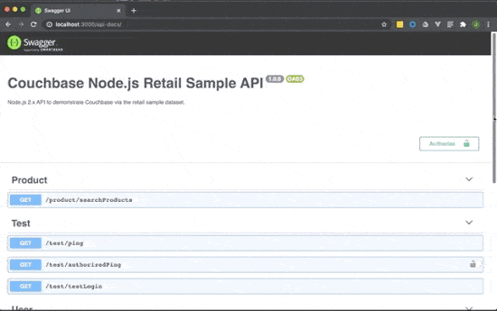

# Lab 0 - Setup

## Lab Overview

In this lab, *git* repositories for the web UI and API will be cloned to serve as local instances to run the web UI and API used in future labs.  Follow the steps below and ask for help if stuck on a step.

>:exclamation:**IMPORTANT**:exclamation:<br> Make sure to read all IMPORTANT, REMEMBER, NOTES and DOCUMENTATION sections as important details will be provided in those sections.

>**IMPORTANT**:<br> The commands provided in the lab should work using *PowerShell*.  Most of the commands (exceptions include creating environment variables) should also work using *Git Bash*.

<br>

[Back to Labs](./windows_labs.md)<br> 

## Steps

[Step 1: Create a working directory](#step-1-create-a-working-directory)<br> 
[Step 2: Setup the Web UI](#step-2-setup-the-web-ui)<br> 
&nbsp;&nbsp;&nbsp;&nbsp;[2a: Clone the web UI git repository](#2a-clone-the-web-ui-git-repository)<br> 
&nbsp;&nbsp;&nbsp;&nbsp;[2b: Verify Environment Variables](#2b-verify-environment-variables)<br> 
&nbsp;&nbsp;&nbsp;&nbsp;[2c: Start the web UI](#2c-start-the-web-ui)<br> 
[Step 3: Create a working directory for the API labs](#step-3-create-a-working-directory-for-the-api-labs)<br> 
[Step 4: Setup Lab 0 API](#step-4-setup-lab-0-api)<br> 
&nbsp;&nbsp;&nbsp;&nbsp;[4a: Clone the API git repository](#4a-clone-the-api-git-repository)<br> 
&nbsp;&nbsp;&nbsp;&nbsp;[4b: Edit the API configuration settings](#4b-edit-the-api-configuration-settings)<br> 
&nbsp;&nbsp;&nbsp;&nbsp;[4c: Start the API](#4c-start-the-api)<br> 
&nbsp;&nbsp;&nbsp;&nbsp;[4d: Verify the API is running](#4d-verify-the-api-is-running)<br> 
&nbsp;&nbsp;&nbsp;&nbsp;[4e: Test the Couchbase connection](#4e-test-the-couchbase-connection)
<br> 

***

### Step 1: Create a working directory

Create a working directory, the directory name is up to the lab participant.  The working directory will be the directory where the repositories for the web UI and API labs reside.
>**Note:** *~/Documents/cbDevDays* is the working directory used as an example, the participant can chose/create their own working directory.  Make sure to use the same working directory throughout all the labs.

```powershell
PS C:\Users\Administrator> mkdir ~/Documents/cbDevDays/
```

[Back to Steps](#steps)<br> 

### Step 2: Setup the web UI
 
Move into the working directory created in [Step 1](#step-1-create-a-working-directory)

```powershell
PS C:\Users\Administrator> cd ~/Documents/cbDevDays/
```

#### 2a: Clone the web UI git repository

*cb-dev-days-web* repository includes all resources needed to run the web UI used in the labs.  Use *git CLI* to clone the repository.

```powershell
PS C:\Users\Administrator\Documents\cbDevDays> git clone https://github.com/thejcfactor/cb-dev-days-web.git
```

Once the repository has been cloned, a *cb-dev-days-web* directory should exist in the current working directory.  Change the working directory to *cb-dev-days-web*.

```powershell
PS C:\Users\Administrator\Documents\cbDevDays> cd cb-dev-days-web
```

#### 2b: Verify environment variables

Check the environment variables to make sure that VUE_APP_API_HOST and VUE_APP_API_PORT variables are set.  The following command should work in both *PowerShell*.  The values of the environment variables should match the following

- VUE_APP_API_HOST=localhost
- VUE_APP_API_PORT=3000

```powershell
PS C:\Users\Administrator\Documents\cbDevDays\cb-dev-days-web> env | grep VUE_
VUE_APP_API_HOST=localhost
VUE_APP_API_PORT=3000

```

If the variables do **not** exist, they can be created by using the following commands

```powershell
PS C:\Users\Administrator\Documents\cbDevDays\cb-dev-days-web> Set-Item -Path Env:VUE_APP_API_HOST -Value "localhost"
PS C:\Users\Administrator\Documents\cbDevDays\cb-dev-days-web> Set-Item -Path Env:VUE_APP_API_PORT -Value 3000
```


#### 2c: Start the web UI

Install the web UI packages by running the following command.

```powershell
PS C:\Users\Administrator\Documents\cbDevDays\cb-dev-days-web> npm install
```

Start the web UI by running the following command to start the npm development server.  Content in the console output is truncated for display purposes in the window below, but the main point is to see the app running message below.
> App running at:<br> 
> \- Local:  http://localhost:8080/

```powershell
PS C:\Users\Administrator\Documents\cbDevDays\cb-dev-days-web> npm run serve

...

App running at:
- Local:   http://localhost:8080/

Note that the development build is not optimized.
To create a production build, run npm run build.

```

Open a browser (we recommend Chrome or Firefox...please don’t use Internet Explorer), and navigate to the web UI’s URL:  http://localhost:8080/

The following web page should be displayed.

>**Note:**  If redirected to the *Login* page, click on the "Couchbase | NoEQUAL" image in the top left corner to get to the *Home* page.


To stop the server using *PowerShell*, enter *ctrl-C* and enter *Y* when prompted to terminate batch job.  If using *Git Bash*, enter *ctrl-C*.

[Back to Steps](#steps)<br> 

### Step 3: Create a working directory for the API labs
Open a new *PowerShell* window (or *Git Bash* window) and move into the working directory created in [Step 1](#step-1-create-a-working-directory)

```powershell
PS C:\Users\Administrator\Documents\cbDevDays\cb-dev-days-web> cd ~/Documents/cbDevDays/
```

Create a working directory for the API labs.

```powershell
PS C:\Users\Administrator\Documents\cbDevDays> mkdir node2x
```

Move into the newly created directory.

```powershell
PS C:\Users\Administrator\Documents\cbDevDays> cd node2x
```

[Back to Steps](#steps)<br> 

### Step 4: Setup Lab 0 API
#### 4a: Clone the API git repository
*cb-dev-days-node2x* repository includes all resources needed to run the Node.js API used in the labs. Use *git CLI* to clone the repository.

```powershell
PS C:\Users\Administrator\Documents\cbDevDays\node2x> git clone https://github.com/thejcfactor/cb-dev-days-node2x.git
```

Once the repository has been cloned, a *cb-dev-days-node2x* directory should exist in the current working directory.  Change the working directory to *cb-dev-days-node2x*.

```powershell
PS C:\Users\Administrator\Documents\cbDevDays\node2x> cd cb-dev-days-node2x
```

#### 4b: Edit the API configuration settings
Note the Node.js API’s project structure detailed in the [Appendix](#nodejs-api-project-structure).

Move to the configuration directory in order to view/edit the **config.json** file.

```powershell
PS C:\Users\Administrator\Documents\cbDevDays\node2x\cb-dev-days-node2x> cd configuration/
```

Edit the **config.json** file using the text editor of your choice.

Edit the following values:
- **host** - Couchbase Server cluster hostname list.  This will be provided by the Couchbase team.

    >:exclamation:**IMPORTANT:**:exclamation: During the summit, host information will be provided.  However, if working on the labs outside of the summit and utilizing a local instance of Couchbase, use the following:<br>
    >&nbsp;&nbsp;&nbsp;&nbsp;**hostname**: "localhost"<br> 
    >&nbsp;&nbsp;&nbsp;&nbsp;**secure**: false<br> 
    >&nbsp;&nbsp;&nbsp;&nbsp;**username**: "Administrator"<br> 


```json
{
  "dev": {
    "appName": "node_2x_api",
    "port": "3000",
    "database": {
      "host": "localhost",
      "secure": true,
      "bucket": "retailsample",
      "username": "svc-devdays",
      "password": "password"
    },
    "secret": "4*@L$VzRp&E%cYZDSoO^E6IPyygYpKHTXJtlOlt!zKTZF@@6l81^rJ1xmCPN%MD2",
    "sessionTTL": 300
  },
  "prod": {}
}
```

#### 4c: Start the API
Move back to the main API working directory.

```powershell
PS C:\Users\Administrator\Documents\cbDevDays\node2x\cb-dev-days-node2x\configuration> cd ..
PS C:\Users\Administrator\Documents\cbDevDays\node2x\cb-dev-days-node2x> ls

    Directory: C:\Users\Administrator\Documents\cbDevDays\node2x\cb-dev-days-node2x


Mode                LastWriteTime         Length Name
----                -------------         ------ ----
d-----        11/6/2020   6:55 PM                configuration
d-----        11/6/2020   6:55 PM                controllers
d-----        11/6/2020   6:55 PM                docs
d-----        11/6/2020   6:55 PM                library
d-----        11/6/2020   6:55 PM                repository
d-----        11/6/2020   6:55 PM                resources
d-----        11/6/2020   6:55 PM                service
-a----        11/6/2020   6:55 PM             13 .dockerignore
-a----        11/6/2020   6:55 PM           1906 .gitignore
-a----        11/6/2020   6:55 PM            897 Dockerfile.dev
-a----        11/6/2020   6:55 PM          99212 package-lock.json
-a----        11/6/2020   6:55 PM            680 package.json
-a----        11/6/2020   6:55 PM           1135 README.md
-a----        11/6/2020   6:55 PM           1848 server.js


```

Install the web UI packages by running the following command.

```powershell
PS C:\Users\Administrator\Documents\cbDevDays\node2x\cb-dev-days-node2x> npm install
```

Start the API by running the following command to start the npm development server.  The express server should be listening on port 3000.

>**Note:** nodemon is used so that any changes made will be reflected on save without having to manually restart the development server.

```powershell
PS C:\Users\Administrator\Documents\cbDevDays\node2x\cb-dev-days-node2x> npm run dev

> node-26-api@1.0.0 dev /app
> nodemon

[nodemon] 2.0.2
[nodemon] to restart at any time, enter `rs`
[nodemon] watching path(s): *.*
[nodemon] watching extensions: js,mjs,json
[nodemon] starting `node server.js`
2020-04-24 02:35:34: server.js - listening on port 3000
2020-04-24 02:35:34: repository.js:connect() - connected to bucket:  retailsample

```

#### 4d: Verify the API is running
Open a browser (we recommend Chrome or Firefox...please don’t use Internet Explorer ;) ), and navigate to the API’s SwaggerUI URL:  http://localhost:3000/api-docs/

The following web page should be displayed.


The Swagger page allows you to work directly with the API.  For the remainder of the labs we will be building out the functionality for certain endpoints under the Product and User paths.

#### 4e: Test the Couchbase connection
You can verify the Couchbase connection by using the ping endpoint under the Test path on API’s Swagger page.  The ping endpoint utilizes the SDK’s health check API (Documentation [here](https://docs.couchbase.com/nodejs-sdk/2.6/health-check.html)).  Follow the steps below (see clip after output for video of steps):
1. Navigate to the SwaggerUI page: http://localhost:3000/api-docs/
2. Click on the */test/ping* endpoint
3. After the panel expands, click the *Try it out* button
4. Click on the *Execute* button
5. The response Code should be 200 and the Response body should be the following. 

```json
{
  "data": "Connected to Couchbase server.",
  "message": "Successfully pinged database.",
  "error": null,
  "authorized": null
}
```



[Back to Steps](#steps)<br> 

### Appendix
#### Node.js API Project Structure
```
|—— configuration
|  |—— config.js
|  |—— config.json
|
|—— controllers
|  |—— productController.js
|  |—— testController.js
|  |—— userController.js
|
|—— library
|  |—— outputMessage.js
|  |—— verifyToken.js
|
|—— repository
|  |—— repository.js
|
|—— service
|  |—— productService.js
|  |—— userService.js
|
|—— Dockefile.dev
|—— package.json
|—— server.js
```

[Back to Overview](#lab-overview)<br> 
