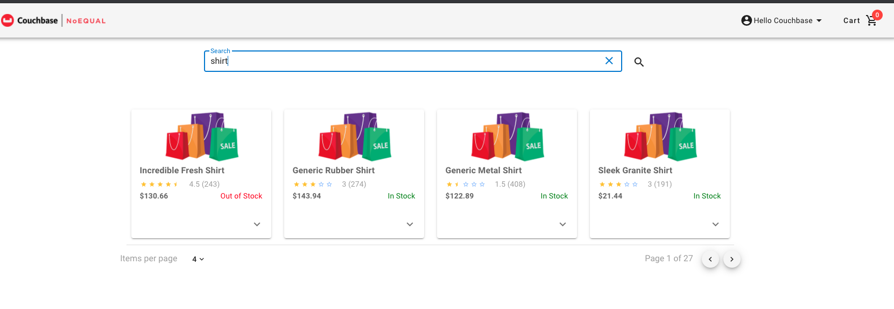

# Lab 2 - FTS Operations

## Lab Overview

The goal of this lab is to create the logic to enable searching for products by utilizing Couchbase’s Node.js SDK to perform full text search (FTS) operations and return multiple documents based on FTS results.   See SDK documentation for details on FTS operations.

>:exclamation:**IMPORTANT**:exclamation:<br> Make sure to read all IMPORTANT, REMEMBER, NOTES and DOCUMENTATION sections as important details will be provided in those sections.

<br>

[Back to Labs](./labs.md)<br> 

## Steps

[Step 1: Add Logic to API](#step-1-add-logic-to-api)<br> 

***

### Step 1: Add Logic to API

>**Documentation:**  SDK documentation on full text search can be found [here](https://docs.couchbase.com/nodejs-sdk/2.6/full-text-searching-with-sdk.html).

>:exclamation:**IMPORTANT:**:exclamation: The K/V get operation result object contains the document along with some other metadata.  For purposes of this lab, and all other labs, only the document contents should be returned.  Therefore, upon a successful get operation, result.value is what should be returned.

*searchProducts()* input:
- product:  string - search term to use on products
- fuzziness:  integer between 0 and 2
- callback

*searchProducts()* output:
- error object, if applicable
- products:  array - product documents found in search

See the following code snippet below for a possible implementation of the *searchProducts()* method.  This, or a similar solution, can be used to implement the *searchProducts()* method logic.  

>:exclamation:**REMEMBER:**  Either comment out or replace the NOP line of code ( e.g. ```callback(null, “NOP”)``` ) with the new code created in the lab.

```javascript
 searchProducts(product, fuzziness, callback) {
   try {
     /**
      * Lab 2:  Search operation (FTS)
      *  1.  FTS:
      *        term query w/ fuzziness
      *        use "basic-search" as index name for searchQuery
      *  2.  K/V getMulti() using FTS results
      *
      */     
     let match = searchQuery.term(product).fuzziness(fuzziness);
 
     let query = searchQuery
       .new("basic-search", match)
       .limit(500)
       .highlight();
 
     let scope = this;
     let results = [];
 
     this.bucket.query(query, function(err, res, meta) {
       if (!err && res.length > 0) {
         //uncomment to see raw results
         // outputMessage(
         //   res,
         //   "repository.js:searchProducts() - search results:"
         // );
         let docIds = res.map(({ id }) => id);
         //uncomment to see doc count
         // outputMessage(
         //   docIds.length,
         //   "repository.js:searchProducts() - total docs:"
         // );
         scope.bucket.getMulti(docIds, function(err, docs) {
           if (!err) {
             for (var key in docs) {
               if (docs[key].error) {
                 continue;
               }
               results.push(docs[key].value);
             }
           }
           callback(err, results);
         });
       } else {
         callback(err, null);
       }
     });
   } catch (err) {
     //Optional - add business logic to handle error types
     outputMessage(err, "repository.js:searchProducts() - error:");
     callback(err, null);
   }
 }
```

Notes about the code:
- Line 10:  creating a term search query that will take into account fuzzy logic
- Lines 12 - 15:  creating a search query with the following parameters:
    + The FTS index to use (this is an index with Couchbase Server)
    + the type of search query to use (created on Line 10, see SDK details for other query types)
    + Limiting and highlighting the results
- Line 20:  All search operations are done at the bucket level for 2.x SDKs (this changes for 3.x SDKs)
- Line 27:  Get a list of product document Ids based on the search results
- Line 33:  Using the multi API, do a bulk get operation to get all the product documents returned from the search
- *outputMessage()*:  a helper method used to easily print out information to the console, method can be found in the /library directory (see API’s project structure detailed in the [Appendix](#nodejs-api-project-structure))
- try/catch & err object handling is purposefully done in a generic fashion.  The lab participant is free to add logic accordingly to test out various methods of handling errors.
- If you would like to uncomment and test the outputMessage() code blocks, remember that that output will be visible in the console logs.

Once complete, make sure the *repository.js* file is saved.  Once the code has been saved, the product search functionality should be active within the web UI.   Follow the steps below to verify the *searchProducts()* logic.

1. Go to
2. If not logged in:
    - In the top right corner, click the *Hello* next to the user icon, and a drop down menu should appear.
    - In the drop down menu, click *Sign In*, the web UI should redirect to the *Login* page.
    - Enter username and password credentials
    - Click *Login*
    - After logging in, the web UI should redirect to the *Home* page.  Go to step #3
3. If not at the *Home* page (i.e. the search box isn’t showing)
4. Enter a product in the *search box* and click the *magnifying glass* to run the search.
    - Example search term: shirt
5. If products exist that match the search term the products will display on the screen (see image below).



[Back to Steps](#steps)<br> 

### Appendix
#### Node.js API Project Structure

```
|—— configuration
|  |—— config.js
|  |—— config.json
|
|—— controllers
|  |—— productController.js
|  |—— testController.js
|  |—— userController.js
|
|—— library
|  |—— outputMessage.js
|  |—— verifyToken.js
|
|—— repository
|  |—— repository.js
|
|—— service
|  |—— productService.js
|  |—— userService.js
|
|—— Dockefile.dev
|—— package.json
|—— server.js
```

[Back to Overview](#lab-overview)<br> 
